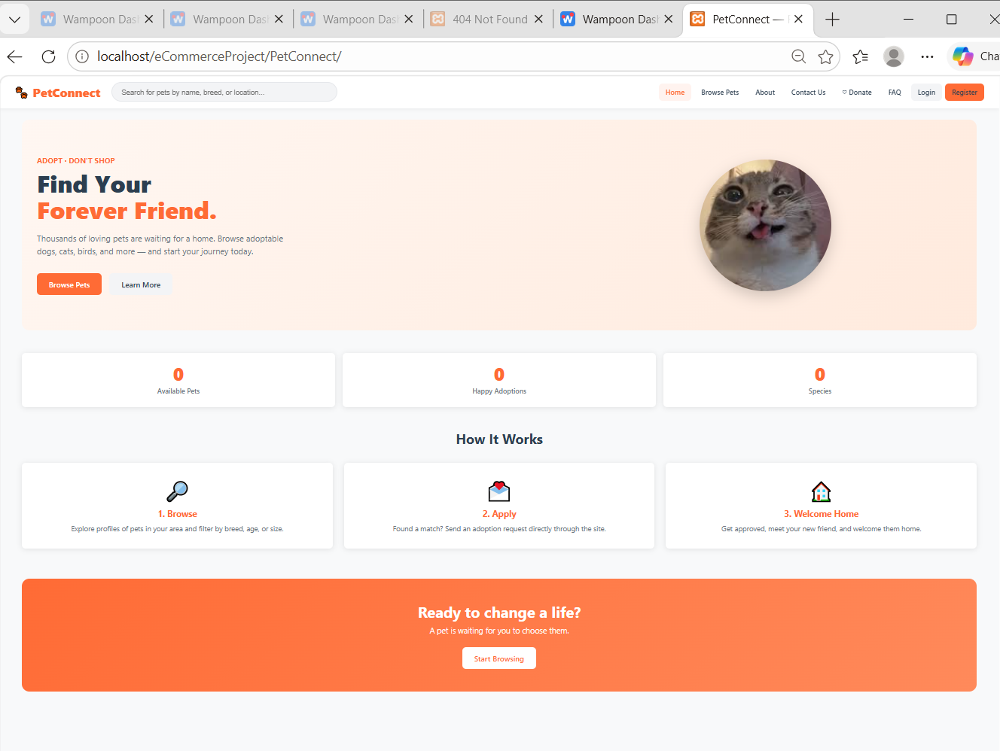

# PetConnect 🐾

A full-stack pet adoption platform built with PHP and the Slim Framework. PetConnect lets users browse adoptable pets, submit adoption requests, and chat with an AI assistant, while giving administrators a complete dashboard to manage pets, users, and the full adoption workflow.

## Application Preview



> PetConnect is run locally using **Wampoon**, which provides the Apache, PHP, and MySQL/MariaDB environment required by the project.

---

## Quick Start

HOW I RUN: OPEN WAPOON, RUN IT, OPEN LOCAL HOST, SELECT ecommerceProject, RUNS

PetConnect requires **Wampoon**, **PHP 8.1+**, **Composer**, and **MySQL/MariaDB**.

1. Install and open Wampoon.
2. Download or clone this repository into Wampoon's web-project directory.
3. Make sure the Apache and MySQL/MariaDB services are running in Wampoon.
4. Create an empty MySQL database named `petconnect`.
5. Open a terminal in the `PetConnect` folder and run `composer install`.
6. Copy `.env.example` to `.env`, then add your local database settings and required API configuration.
7. Open `http://localhost/eCommerceProject/PetConnect/` in your browser.
8. Run the seed route once if sample data is required.

The included `run.bat` and `run.sh` launchers can also be used after the local environment is configured.

## Features

- **Pet Listings** — Browse, filter, and search adoptable pets by species, age, and availability
- **Adoption Requests** — Submit, track, and manage adoption applications with status updates
- **AI Chat Assistant** — Powered by Groq's Llama 3.3 model; helps users find the right pet
- **User Authentication** — Secure registration and login with email-based two-factor authentication (2FA) and password reset
- **User Profiles** — Manage account details, upload an avatar, and view adoption history
- **Admin Dashboard** — Full CRUD for pets and categories, user management, and adoption approval/rejection workflows
- **Bilingual Support** — Full English and French localization (switchable at runtime)
- **Email Notifications** — SMTP-based transactional emails via PHPMailer (registration, 2FA codes, password reset)
- **Maintenance Mode** — Toggle a site-wide maintenance page with a single constant
- **Security** — CSP/security headers middleware, CSRF-safe session handling, bcrypt password hashing

---

## Tech Stack

| Layer | Technology |
|---|---|
| Language | PHP 8.1+ |
| Framework | Slim Framework 4 |
| Templating | Twig 3 |
| ORM | RedBeanPHP 5 |
| Auth | delight-im/auth + RobThree/TwoFactorAuth |
| Dependency Injection | PHP-DI 7 |
| Email | PHPMailer 6 |
| AI Chat | Groq API (Llama 3.3 70B) |
| Localization | Symfony Translation 7 |
| Environment | vlucas/phpdotenv |
| Frontend | Vanilla JS + CSS (no framework) |
| Database | MySQL (MariaDB) |

---

## Project Structure

```
PetConnect/
├── src/
│   ├── Controllers/      # Request handlers (Auth, Pet, Adoption, Admin, Chat, User)
│   ├── Models/           # RedBeanPHP model wrappers (Pet, User, AdoptionRequest, …)
│   ├── Middleware/       # PSR-15 middleware (Auth, Admin, Flash, Security, Maintenance)
│   ├── Services/         # Mailer.php — PHPMailer abstraction
│   └── I18n/             # I18n.php — Symfony Translation wrapper
├── templates/            # Twig templates (extends base.twig)
├── Assets/
│   ├── styles.css        # All site CSS
│   ├── app.js            # Live search, flash animations
│   ├── chat.js           # AI chat widget
│   └── images/           # Static images
├── Translations/         # messages.en.php / messages.fr.php
├── index.php             # App entry point — DI container, middleware, routes
├── composer.json
├── Dockerfile
└── .env.example
```

**Request flow:** `.htaccess` → `index.php` → Middleware stack → Controller → Model / Twig → Response

---

## Getting Started

### Prerequisites

- PHP 8.1+
- Composer
- MySQL (MariaDB)
- A web server with `mod_rewrite` enabled (Apache/WAMPOON)

### Local Setup (WAMPOON / Apache)

1. **Clone the repository**

   ```bash
   git clone https://github.com/your-username/PetConnect.git
   cd PetConnect
   ```

2. **Install dependencies**

   ```bash
   composer install
   ```

3. **Configure environment**

   ```bash
   cp .env.example .env
   ```

   Then edit `.env` with your values:

   ```env
   DB_HOST=127.0.0.1
   DB_NAME=petconnect
   DB_USER=root
   DB_PASS=

   GROQ_API_KEY=         # https://console.groq.com
   SEED_TOKEN=           # any secret string to protect the /seed route

   MAIL_HOST=smtp.gmail.com
   MAIL_PORT=587
   MAIL_USERNAME=
   MAIL_PASSWORD=
   MAIL_FROM=
   MAIL_FROM_NAME=PetConnect
   ```

4. **Seed the database**

   Visit the following URL in your browser once the server is running:

   ```
   http://localhost/PetConnect/seed
   ```

   This auto-creates all tables (RedBeanPHP handles schema) and inserts sample pets, categories, and a default admin user.

   > The seed route creates a local demonstration administrator. Review the seed configuration before using it.

5. **Open the app**

   ```
   http://localhost/PetConnect/
   ```

## Environment Variables

| Variable | Required | Description |
|---|---|---|
| `DB_HOST` | Yes | MySQL host |
| `DB_NAME` | Yes | Database name |
| `DB_USER` | Yes | Database user |
| `DB_PASS` | Yes | Database password |
| `APP_ENV` | No | `development` or `production` |
| `GROQ_API_KEY` | Yes (for AI chat) | API key from [console.groq.com](https://console.groq.com) |
| `SEED_TOKEN` | No | Secret token to protect the `/seed` route |
| `MAIL_HOST` | Yes (for email) | SMTP host |
| `MAIL_PORT` | Yes (for email) | SMTP port (typically `587`) |
| `MAIL_USERNAME` | Yes (for email) | SMTP username |
| `MAIL_PASSWORD` | Yes (for email) | SMTP password |
| `MAIL_FROM` | Yes (for email) | Sender email address |
| `MAIL_FROM_NAME` | No | Sender display name |

---

## Key Routes

| Method | Route | Description |
|---|---|---|
| GET | `/` | Home page |
| GET | `/pets` | Browse and filter all pets |
| GET | `/pets/search` | Live search endpoint |
| GET | `/pets/{id}` | Pet detail page |
| GET/POST | `/register` | User registration |
| GET/POST | `/login` | Login + 2FA flow |
| GET/POST | `/reset-password` | Password reset flow |
| GET/POST | `/pets/{id}/adopt` | Submit an adoption request |
| GET | `/adoptions` | View your adoption history |
| GET | `/adoptions/{id}` | View a specific adoption status |
| GET | `/profile` | User profile page |
| POST | `/api/chat` | AI chat API (authenticated) |
| GET | `/admin` | Admin dashboard |
| GET | `/admin/adoptions` | Manage adoption requests |
| GET | `/admin/users` | Manage users |
| GET | `/lang/{locale}` | Switch language (`en` / `fr`) |

---

## Localization

The app supports **English** and **French**. Switch the language at any time via:

```
/lang/en
/lang/fr
```

The selected language is stored in the session. Templates use a `__('key')` helper defined in `src/I18n/I18n.php`. To add a new language, create `Translations/messages.{locale}.php` and register the locale in `I18n.php`.

---

## Maintenance Mode

To take the site offline for maintenance, open `index.php` and set:

```php
define('MAINTENANCE_MODE', true);
```

All requests will be intercepted by `MaintenanceMiddleware` and served the maintenance page. Set it back to `false` to restore normal operation.

---

## License

This project is for educational purposes. See [LICENSE](LICENSE) for details.
